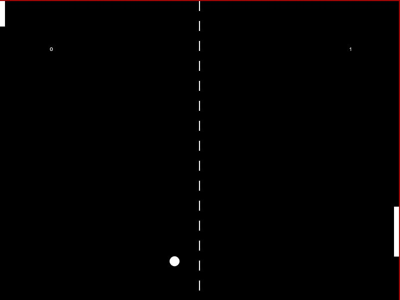
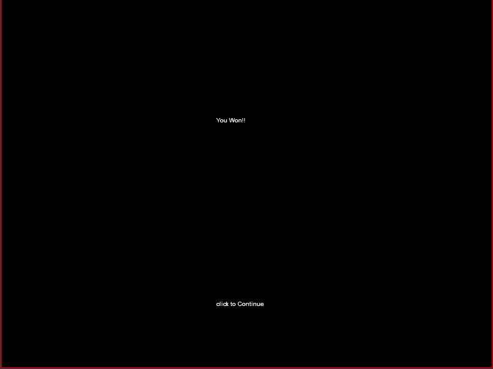
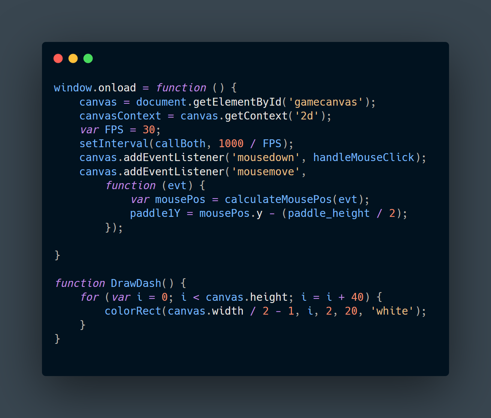
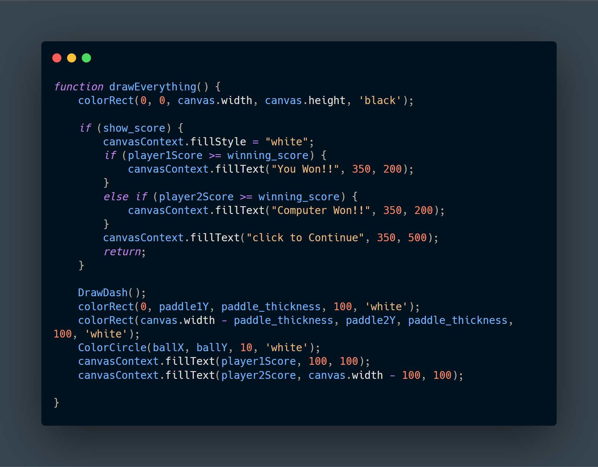

## Paddle Game

This paddle game is purely made with JavaScript. The canvass element of HTML is used to make the canvass. No external third party library is used.

## Game Play Screen

### &nbsp; &nbsp; &nbsp; &nbsp; &nbsp; &nbsp; &nbsp; &nbsp; &nbsp; &nbsp; &nbsp; &nbsp; &nbsp; &nbsp; &nbsp;  You &nbsp; &nbsp; &nbsp; &nbsp; &nbsp; &nbsp; &nbsp; &nbsp; &nbsp; &nbsp; &nbsp; &nbsp; &nbsp; &nbsp; &nbsp; &nbsp; &nbsp; &nbsp; &nbsp; &nbsp; &nbsp; &nbsp; &nbsp; &nbsp; &nbsp; &nbsp; &nbsp; &nbsp; &nbsp; &nbsp; &nbsp; &nbsp; &nbsp; &nbsp; Computer

## Win Screen

## Game Play Demonstration

## Code Snippets of this game

 &nbsp; &nbsp;

### Happy Gaming😄😄!!!
